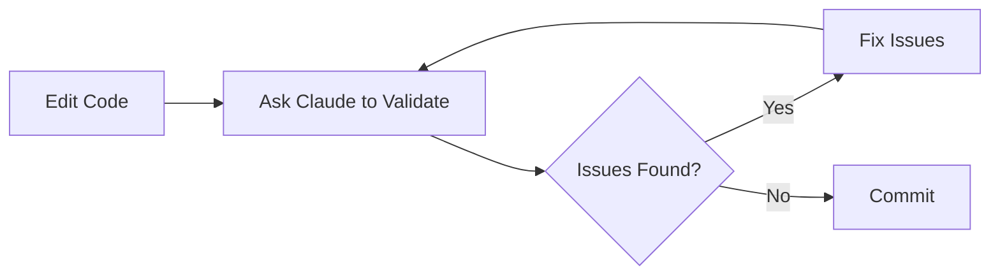

# Claude Code Skills and Agents

This directory contains custom skills and agents for the infrastructure project automation.

## Overview

**Skills** are lightweight, focused capabilities that Claude can use to perform specific tasks. They're perfect for validation, review, and analysis tasks.

**Agents** are more complex, autonomous systems that can handle multi-step workflows with tool use and iteration.

## Available Skills

### 1. Packer Validation (`packer-validation`)

**Purpose:** Validates Packer HCL templates against best practices

**When to use:**
- Before running `packer build`
- When creating/updating templates
- During code reviews

**Example:**
```
"Can you validate my Packer templates?"
```

**What it checks:**
- Syntax validation (`packer fmt`, `packer validate`)
- Deprecated options (boot_iso vs iso_url)
- Ansible provisioner configuration
- Proxmox-specific settings
- Disk optimization for ZFS
- Security (no hardcoded secrets)

### 2. Terraform Review (`terraform-review`)

**Purpose:** Reviews Terraform configurations for security and best practices

**When to use:**
- Before running `terraform apply`
- When creating modules
- During code reviews

**Example:**
```
"Can you review my Terraform configurations?"
```

**What it checks:**
- Syntax and formatting (`terraform fmt`, `terraform validate`)
- Provider version constraints
- Security scanning (`tflint`, `trivy`)
- Proxmox/Talos-specific validation
- Resource naming conventions
- Secret management

### 3. SOPS Management (`sops-management`)

**Purpose:** Manages encrypted secrets with SOPS + Age

**When to use:**
- Adding/updating secrets
- Rotating encryption keys
- Debugging secret access
- Before committing changes

**Example:**
```
"Can you help me add a new secret to SOPS?"
```

**What it does:**
- Validates .sops.yaml configuration
- Encrypts/decrypts secrets
- Checks for plaintext leaks
- Guides integration with Packer/Terraform
- Verifies Age key setup

## How to Use Skills

Skills are automatically discovered by Claude Code. Simply ask Claude to perform tasks related to the skill:

**Direct invocation:**
```
"Use the packer-validation skill to check my templates"
```

**Natural language:**
```
"Can you validate my Packer templates?"
"Review my Terraform code for security issues"
"Help me encrypt a new secret with SOPS"
```

Claude will automatically select and use the appropriate skill based on your request.

## Creating New Skills

1. **Create skill directory:**
   ```bash
   mkdir -p .claude/skills/my-new-skill
   ```

2. **Create SKILL.md:**
   ```bash
   touch .claude/skills/my-new-skill/SKILL.md
   ```

3. **Define the skill:**
   ```markdown
   # My New Skill

   Purpose description here.

   ## When to Use

   List scenarios...

   ## What This Skill Does

   1. Step one
   2. Step two
   ```

4. **Test the skill:**
   ```
   "Use my-new-skill to [task]"
   ```

## Best Practices

### Skill Design

- **Focus on one thing:** Each skill should have a clear, specific purpose
- **Clear triggers:** Document when the skill should be used
- **Actionable steps:** List concrete validation/review steps
- **Examples:** Provide usage examples
- **Tool integration:** Reference actual commands (packer validate, tflint, etc.)

### Using Skills Effectively

- **Be specific:** "Validate Packer templates" is clearer than "check my code"
- **Provide context:** Mention which files/directories to check
- **Review results:** Always review skill outputs before taking action
- **Iterate:** Use skills multiple times during development

### Security

- **Never commit secrets:** Use SOPS for all sensitive data
- **Validate before commit:** Run skills before git commits
- **Regular reviews:** Periodically review all configurations
- **Update skills:** Keep skills current with tool updates

## Integration with Project Workflow

### Pre-commit Checks

Use skills before committing:
```bash
# Example workflow
1. Edit Packer template
2. Ask Claude: "Validate my Packer templates"
3. Fix any issues found
4. Ask Claude: "Check for any plaintext secrets"
5. Commit changes
```

### Pull Request Reviews

Use skills during PR review:
```bash
1. Claude reviews changed files
2. Runs appropriate skills (packer-validation, terraform-review)
3. Reports findings
4. Suggests fixes
```

### Development Workflow



## File Structure

```
.claude/
├── README.md                           # This file
├── skills/
│   ├── packer-validation/
│   │   └── SKILL.md                    # Packer validation skill
│   ├── terraform-review/
│   │   └── SKILL.md                    # Terraform review skill
│   └── sops-management/
│       └── SKILL.md                    # SOPS management skill
└── agents/
    └── (future complex agents here)
```

## Common Commands

```bash
# List available skills
/skills

# Manage agents
/agents

# View skill help
Ask Claude: "What skills are available?"

# Use a specific skill
Ask Claude: "Use [skill-name] to [task]"

# Debug skill issues
claude --debug
```

## Troubleshooting

**Skill not found:**
- Check .claude/skills/ directory exists
- Verify SKILL.md file exists
- Check file formatting

**Skill not triggering:**
- Be more explicit in request
- Mention skill name directly
- Check skill's "When to Use" section

**Skill errors:**
- Check tool availability (packer, terraform, tflint, etc.)
- Verify paths are correct
- Check environment variables

## Future Enhancements

Planned additions:
- **ansible-lint skill** - Ansible playbook validation
- **vm-deployment agent** - Multi-step VM deployment automation
- **packer-builder agent** - Complete image build workflow
- **infrastructure-audit agent** - Comprehensive security audit

## Resources

- [Claude Code Documentation](https://docs.anthropic.com/claude-code)
- [Skills Guide](https://docs.anthropic.com/claude-code/skills)
- [Agent SDK](https://docs.anthropic.com/claude-agent-sdk)
- Project: [CLAUDE.md](/home/wdiaz/devland/infra/CLAUDE.md)

## Contributing

When adding new skills:
1. Create skill in `.claude/skills/[skill-name]/`
2. Document in SKILL.md
3. Test thoroughly
4. Update this README
5. Commit to repository

---

**Last Updated:** 2026-01-05
**Project:** Infrastructure as Code (Proxmox + Talos)
**Maintainer:** wdiaz
